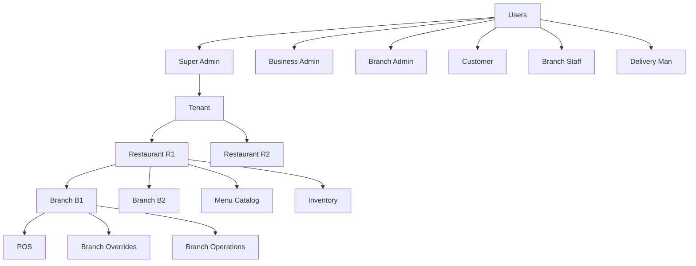
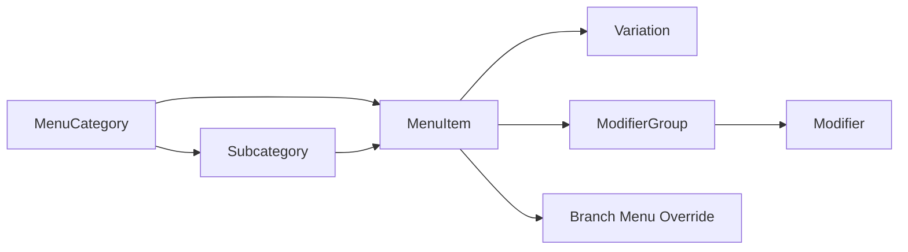
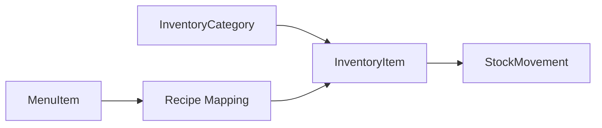

# DeliveryWays Catalog & Inventory Flow

## Objective
Define a restaurant-first module design for menu/catalog and inventory with clear role ownership, branch-level overrides, and scalable API boundaries.

## Ownership Hierarchy

## Domain Split

- `menu` module: customer-facing catalog structures.
- `inventory` module: internal stock/procurement structures.
- Categories are intentionally separate in each domain.

### Why separate categories?
- Menu categories: `Burgers`, `Drinks`, `Desserts` (customer-facing)
- Inventory categories: `Meat`, `Dairy`, `Packaging`, `Sauces` (operations-facing)

They are different taxonomy systems, owned by different workflows.

## Menu Flow

### Menu Rules
- Categories/subcategories can be created only by restaurant-level roles (Business Admin / Super Admin).
- Branch cannot create category/subcategory.
- Branch can set item availability override and optional price override.
- Variations are separate from modifiers:
  - Variation = core version (`Small`, `Medium`, `Large`).
  - Modifier = optional customization (`Extra cheese`, `No onion`).
- Food classification is stored on menu item (`dietaryFlags` / `allergenFlags`), e.g. veg/non-veg/halal.

## Inventory Flow

### Inventory Rules
- Inventory categories/items are restaurant-scoped.
- Stock movements adjust `currentQty` (`IN`/`OUT`/`ADJUST`).
- Recipe mapping links menu items to inventory items for consumption calculations.

## Scope Model
- Primary scope for catalog/inventory: `restaurantId`
- Optional branch behavior: overrides at branch level
- Tenant can be derived through restaurant relation for analytics and permission checks

## Roles & Access

### Writes (create/update/delete)
- `SUPER_ADMIN`, `BUSINESS_ADMIN`

### Branch-level overrides
- `SUPER_ADMIN`, `BUSINESS_ADMIN`, `BRANCH_ADMIN`

### Read
- Admin endpoints: authenticated roles
- Public catalog endpoint: customer app access (restaurant + optional branch context)

## Bulk Operations
- Bulk category creation (`menu`)
- Bulk item creation (`menu`)
- Bulk branch availability toggles
- Batch processing should be transaction-safe with validation first

## API Surface (Phase 1)

### Menu
- `POST /menu/categories`
- `POST /menu/categories/bulk`
- `GET /menu/categories`
- `PATCH /menu/categories/:id`
- `DELETE /menu/categories/:id`
- `POST /menu/items`
- `POST /menu/items/bulk`
- `GET /menu/items`
- `PATCH /menu/items/:id`
- `DELETE /menu/items/:id`
- `POST /menu/variations`
- `GET /menu/variations`
- `PATCH /menu/variations/:id`
- `DELETE /menu/variations/:id`
- `POST /menu/modifier-groups`
- `GET /menu/modifier-groups`
- `PATCH /menu/modifier-groups/:id`
- `DELETE /menu/modifier-groups/:id`
- `POST /menu/modifiers`
- `PATCH /menu/modifiers/:id`
- `DELETE /menu/modifiers/:id`
- `POST /menu/items/:itemId/modifier-groups/:groupId`
- `POST /menu/branch-overrides/items`
- `POST /menu/branch-overrides/categories`
- `GET /menu/public/catalog`

### Inventory
- `POST /inventory/categories`
- `GET /inventory/categories`
- `PATCH /inventory/categories/:id`
- `DELETE /inventory/categories/:id`
- `POST /inventory/items`
- `GET /inventory/items`
- `PATCH /inventory/items/:id`
- `DELETE /inventory/items/:id`
- `POST /inventory/movements`
- `GET /inventory/movements`
- `POST /inventory/recipes`
- `GET /inventory/recipes`
- `DELETE /inventory/recipes/:id`

## Notes
- Response envelope remains `{ success, data, message, meta? }`.
- Soft-delete policy is used for catalog/inventory entities tied to operational history.
